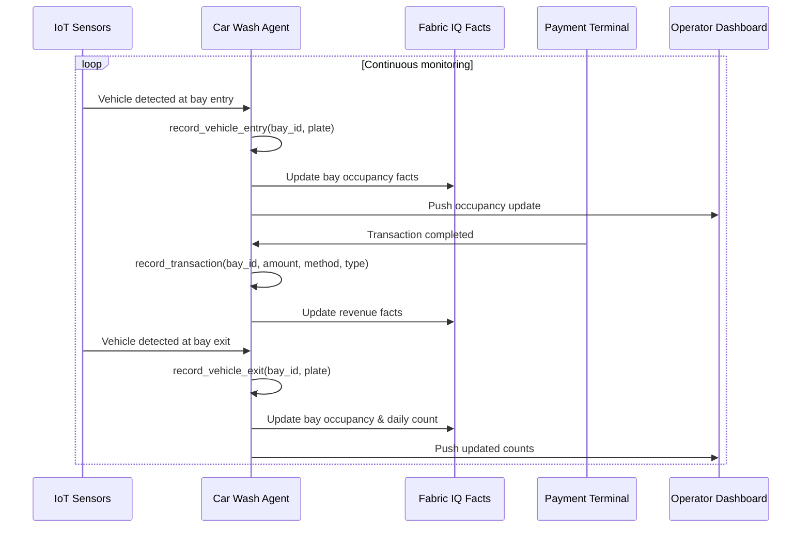
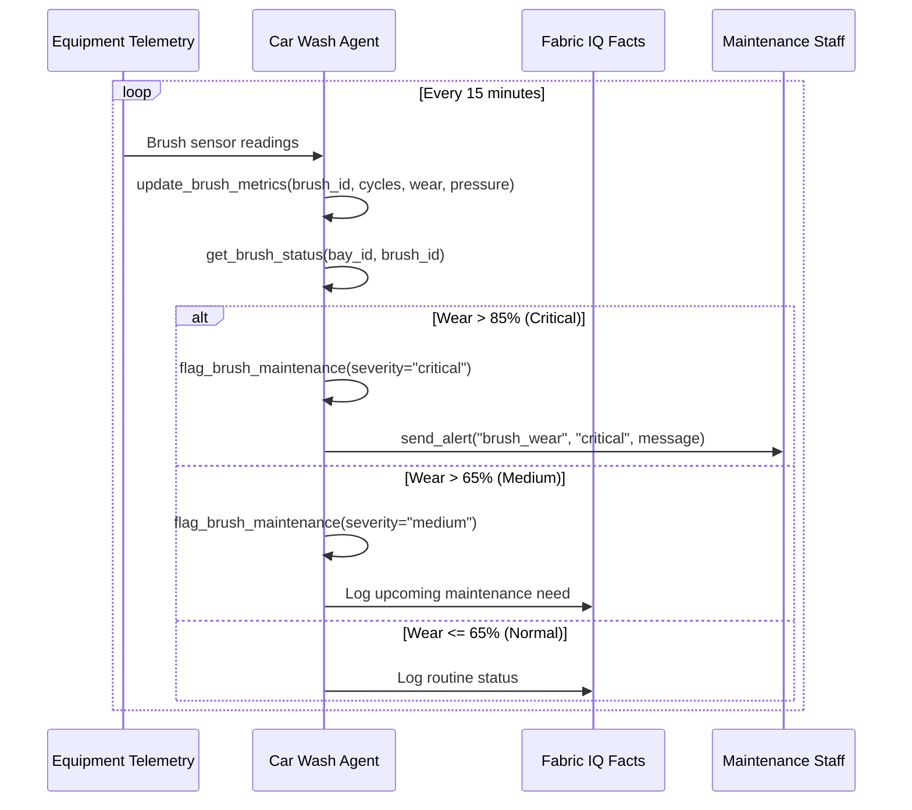
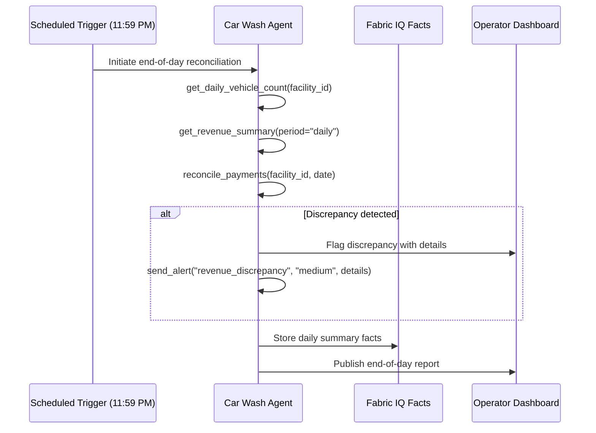

# Autonomous Car Wash Agent Specification

## Overview

| Property | Value |
|----------|-------|
| **Spec ID** | `ACW-001` |
| **Version** | `1.0.0` |
| **Status** | `Active` |
| **Domain** | Facility Operations |
| **Agent Type** | Single Agent with Tools |
| **Governance Model** | Autonomous |

## Business Framing

Commercial car wash facilities handle hundreds of vehicles per day across multiple bays, requiring real-time visibility into bay occupancy, equipment health, and revenue collection. Manual tracking leads to inaccurate counts, deferred maintenance, and revenue leakage. This agent autonomously monitors the car wash facility end-to-end—tracking vehicles entering and exiting, monitoring brush condition and wear, and reconciling all charges and payments collected throughout the day—without human intervention.

### Value Proposition
The Autonomous Car Wash Agent replaces clipboard-based tracking and manual register reconciliation with continuous, sensor-driven awareness. It integrates with IoT sensors for vehicle detection and equipment telemetry, payment terminals for revenue tracking, and Fabric IQ for ontology-grounded facility facts. Operators receive real-time dashboards and automated alerts, enabling them to focus on customer service rather than bookkeeping.

## Target Problems Addressed

| Problem | Impact | Agent Solution |
|---------|--------|----------------|
| Inaccurate vehicle counts | Revenue leakage, bad forecasting | Real-time sensor-based tracking |
| Missed brush maintenance | Equipment failure, vehicle damage | Continuous wear monitoring & alerts |
| Manual revenue reconciliation | Errors, time-consuming | Automated charge & payment tracking |
| No real-time facility visibility | Slow decision-making | Live dashboard with alerts |
| Shift-handoff data loss | Incomplete records | Persistent facts memory across shifts |

## Agent Architecture

### Single Agent with Tool Orchestration

```
┌─────────────────────────────────────────────────────────────────────┐
│                   Car Wash Operations Agent                         │
│      Orchestrates tools for vehicle, equipment & revenue tracking    │
└────────────────────┬────────────────────────────────────────────────┘
                     │
    ┌────────┬───────┼────────┬────────────┐
    ▼        ▼       ▼        ▼            ▼
┌────────┐┌────────┐┌────────┐┌──────────┐┌──────────┐
│Vehicle ││Brush   ││Payment ││Facts     ││Alerting  │
│Tracker ││Monitor ││Ledger  ││Memory    ││Engine    │
└────────┘└────────┘└────────┘└──────────┘└──────────┘
```

### Control Plane Integration

| Component | Azure Service | Integration Pattern |
|-----------|---------------|---------------------|
| API Gateway | Azure API Management | MCP façade |
| Agent Runtime | Azure Kubernetes Service | Workload identity |
| Facts Memory | Fabric IQ | Ontology-grounded facility facts |
| IoT Ingestion | Azure IoT Hub | Vehicle & equipment telemetry |
| Stream Processing | Azure Event Hubs | Real-time sensor events |
| Identity | Microsoft Entra ID | Agent Identity |
| Observability | Azure Monitor + App Insights | OpenTelemetry |
| Dashboards | Azure Managed Grafana | Operator dashboards |

## MCP Tool Catalog

| Tool Name | Description | Input Schema |
|-----------|-------------|--------------|
| `record_vehicle_entry` | Register a vehicle entering a wash bay | `{ bay_id: string, plate_number: string?, timestamp: datetime }` |
| `record_vehicle_exit` | Register a vehicle exiting a wash bay | `{ bay_id: string, plate_number: string?, timestamp: datetime }` |
| `get_bay_occupancy` | Retrieve current occupancy for all bays | `{ facility_id: string }` |
| `get_daily_vehicle_count` | Get total vehicles processed today | `{ facility_id: string, date: date? }` |
| `get_brush_status` | Retrieve brush condition telemetry | `{ bay_id: string, brush_id: string }` |
| `update_brush_metrics` | Record brush wear data from sensors | `{ brush_id: string, cycle_count: int, wear_pct: float, pressure_psi: float }` |
| `flag_brush_maintenance` | Flag a brush for maintenance or replacement | `{ brush_id: string, severity: "low" \| "medium" \| "critical", reason: string }` |
| `record_transaction` | Record a charge/payment transaction | `{ bay_id: string, amount: decimal, payment_method: string, wash_type: string, timestamp: datetime }` |
| `get_revenue_summary` | Get revenue totals by period | `{ facility_id: string, period: "hourly" \| "daily" \| "weekly", date: date? }` |
| `reconcile_payments` | Reconcile charges vs. payments collected | `{ facility_id: string, date: date }` |
| `get_facility_facts` | Retrieve facility facts from Fabric IQ | `{ facility_id: string, domain: "carwash" }` |
| `send_alert` | Send operational alert to staff | `{ alert_type: string, severity: string, message: string, channel: "sms" \| "teams" \| "dashboard" }` |

## Workflow Specification

### Primary Flow: Continuous Vehicle & Revenue Tracking



### Secondary Flow: Brush Health Monitoring



### Tertiary Flow: End-of-Day Reconciliation



## Fabric IQ Facts Memory Integration

### Car Wash Domain Ontology

| Entity Type | Attributes | Relationships |
|-------------|------------|---------------|
| Facility | id, name, location, bay_count, operating_hours | has_bays |
| Bay | id, facility_id, type, status | belongs_to_facility, has_brushes, processes_vehicles |
| Vehicle | id, plate_number, entry_time, exit_time, wash_type | processed_in_bay, has_transaction |
| Brush | id, bay_id, type, install_date, cycle_count, wear_pct | installed_in_bay |
| Transaction | id, bay_id, amount, payment_method, wash_type, timestamp | belongs_to_bay, for_vehicle |
| DailySummary | id, facility_id, date, vehicle_count, revenue_total, discrepancies | summarizes_facility |

### Fact Types

| Fact Type | Example | Usage |
|-----------|---------|-------|
| `observation` | "Bay 2 currently occupied" | Real-time state |
| `measurement` | "Brush B1 wear at 72%" | Sensor-derived |
| `derived` | "Revenue per vehicle today is $14.20" | Calculated |
| `rule` | "Critical brush wear requires immediate replacement" | Business logic |
| `aggregate` | "142 vehicles processed today" | Running totals |

### Sample Facts Query

```json
{
  "query": "bays with brush wear above maintenance threshold",
  "domain": "carwash",
  "filters": {
    "fact_type": "measurement",
    "entity_type": "Brush",
    "wear_pct_gt": 0.65
  },
  "limit": 50
}
```

## Success Metrics (KPIs)

### Business Metrics

| Metric | Target | Measurement |
|--------|--------|-------------|
| Vehicle Count Accuracy | > 99% | Sensor vs. manual audit |
| Revenue Reconciliation Accuracy | > 99.5% | Charges vs. collections |
| Brush Downtime Reduction | -30% | Unplanned maintenance events |
| Revenue Leakage Reduction | -90% | Pre/post agent comparison |
| Operator Time Saved | > 2 hrs/day | Manual tracking eliminated |

### Technical Metrics

| Metric | Target | Measurement |
|--------|--------|-------------|
| Sensor Event Processing Latency | < 200ms | Event Hub to agent |
| API Latency P95 | < 300ms | App Insights |
| Facts Query Latency | < 200ms | Fabric IQ metrics |
| Agent Uptime | 99.9% | Health probes |
| Dashboard Refresh Rate | < 5s | Grafana metrics |

## Testing Requirements

### Unit Tests

| Test Category | Coverage Target | Description |
|---------------|-----------------|-------------|
| Vehicle Entry/Exit Logic | 95% | Counting accuracy, edge cases (re-entry, timeout) |
| Brush Wear Calculation | 90% | Threshold detection, wear interpolation |
| Revenue Aggregation | 95% | Totals, payment method breakdown, rounding |
| MCP Protocol | 100% | Tool schema compliance |
| Alert Routing | 90% | Correct severity mapping and channel selection |

### Integration Tests

| Test Scenario | Validation |
|---------------|------------|
| Full vehicle lifecycle | Entry → wash → payment → exit tracked correctly |
| Brush maintenance flow | Wear threshold triggers alert and maintenance flag |
| End-of-day reconciliation | Vehicle count matches transactions, revenue balanced |
| Sensor failover | Agent handles sensor disconnect gracefully |
| Multi-bay concurrent operations | Parallel bay events processed without data loss |

### Evaluation Tests

| Evaluation | Framework | Threshold |
|------------|-----------|-----------|
| Count Accuracy | Audit comparison | > 99% match |
| Revenue Reconciliation | Ledger verification | > 99.5% match |
| Alert Timeliness | Event-to-alert latency | < 30s for critical |
| Groundedness | Fact verification | > 0.95 |

## Fine-Tuning Specification

### Episode Capture

| Field | Description |
|-------|-------------|
| `episode_id` | Unique identifier |
| `agent_id` | carwash-operations-agent |
| `facility_id` | Monitored facility |
| `event_type` | vehicle_entry, vehicle_exit, brush_reading, transaction, reconciliation |
| `input_signals` | Sensor data provided to agent |
| `action_taken` | Agent action (record, alert, flag, reconcile) |
| `outcome` | Verified correctness (audit match, maintenance prevented, revenue matched) |

### Reward Signals

| Signal | Source | Weight |
|--------|--------|--------|
| Correct vehicle count (audit match) | Manual audit | 1.0 |
| Revenue correctly reconciled | Ledger audit | 1.0 |
| Brush failure prevented (proactive flag) | Maintenance log | 0.8 |
| Alert acted upon by staff | Staff feedback | 0.3 |
| Missed vehicle (false negative) | Audit discrepancy | -1.0 |
| False brush alert (unnecessary maintenance) | Maintenance log | -0.3 |
| Revenue discrepancy missed | Ledger audit | -1.0 |

## Governance & Compliance

### Data Privacy

| Requirement | Implementation |
|-------------|----------------|
| License Plate Handling | Hashed after session; no long-term PII storage |
| Payment Data | PCI-DSS compliant; tokenized card references only |
| Data Retention | 90-day operational logs; 7-year financial records |
| Access Control | Role-based access (operator, manager, auditor) |
| Audit Trail | All transactions and state changes logged immutably |

### Human Oversight

| Scenario | Escalation Path |
|----------|-----------------|
| Revenue discrepancy > $100 | Immediate manager notification via Teams |
| Critical brush failure | Maintenance team SMS + dashboard alert |
| Sensor outage > 5 minutes | Operations manager notification |
| Unusual vehicle volume spike (>2σ) | Manager review recommended |

## Version History

| Version | Date | Author | Changes |
|---------|------|--------|---------|
| 1.0.0 | 2026-03-14 | Azure Agents Team | Initial specification |
