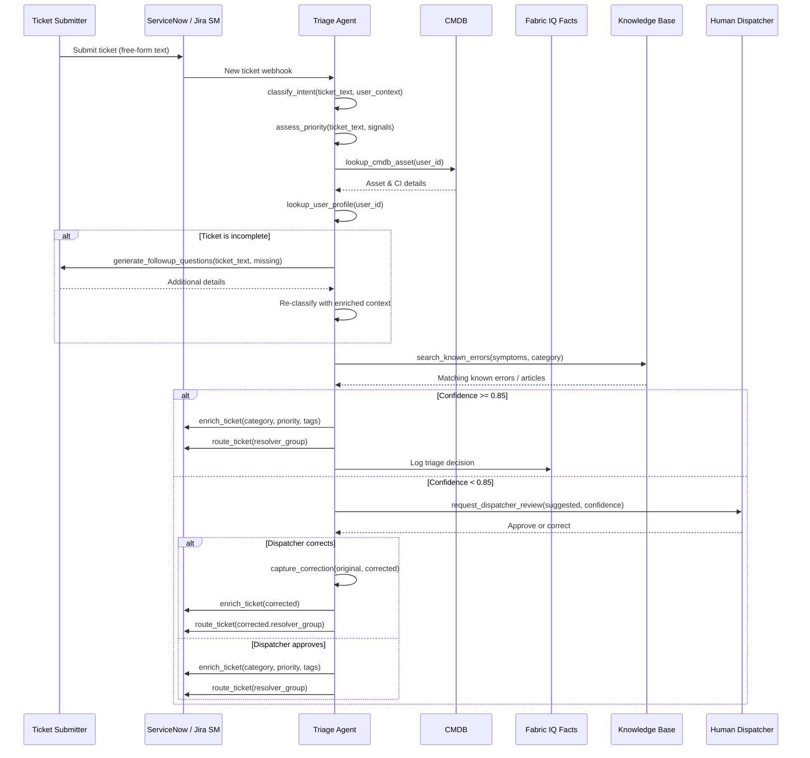
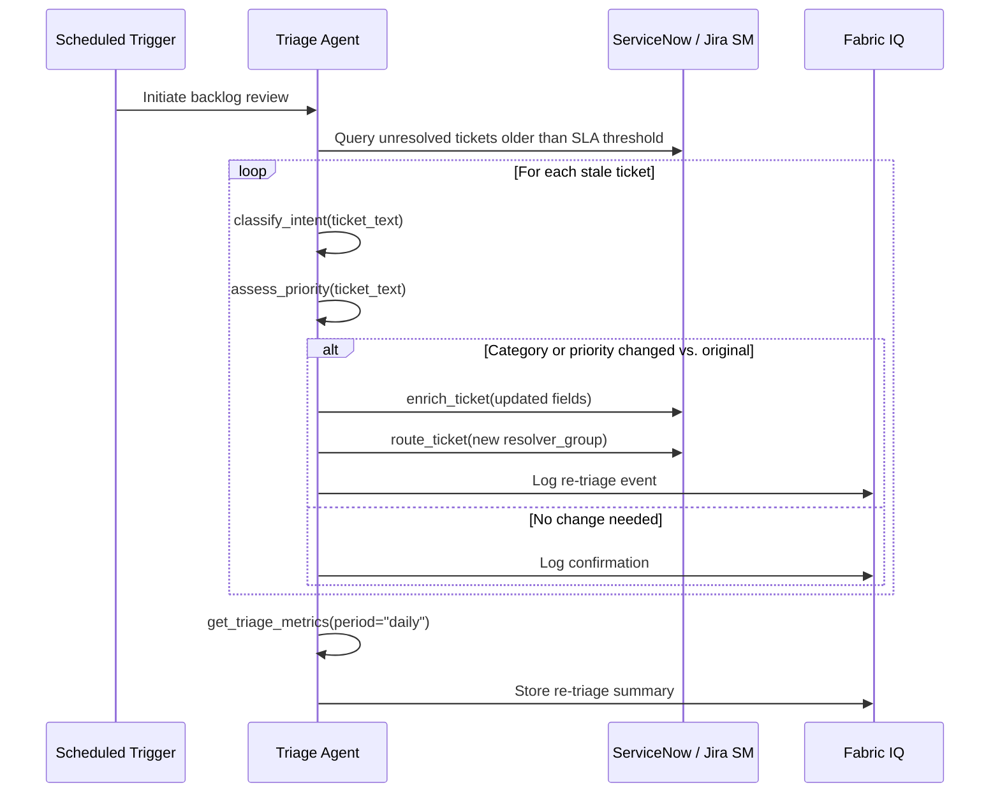
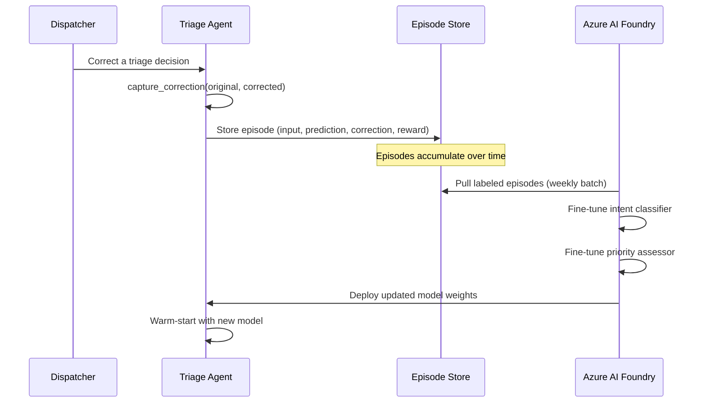

# Help Desk Triage Agent Specification

## Overview

| Property | Value |
|----------|-------|
| **Spec ID** | `HDT-001` |
| **Version** | `1.0.0` |
| **Status** | `Active` |
| **Domain** | IT Service Management |
| **Agent Type** | Single Agent with Tools |
| **Governance Model** | Autonomous with HITL for escalations |

## Business Framing

Enterprise help desks receive thousands of tickets daily from employees, contractors, and external users. Tickets arrive in free-form natural language—often vague, incomplete, or mislabeled—making accurate triage the single biggest bottleneck in incident resolution. A ticket saying *"my thing isn't working"* could be a VPN issue, a laptop hardware failure, a SaaS license expiration, or a password reset. Human dispatchers spend 30–40% of their time re-reading, re-categorizing, and re-routing tickets that were initially misclassified.

This domain is uniquely suited for fine-tuning because:

1. **Ambiguous intent**: Users rarely describe their issue in technical terms. The same symptom (*"I can't open my files"*) maps to completely different root causes depending on context (OneDrive sync failure, expired license, ransomware, network drive unmapped).
2. **High category cardinality**: Enterprises typically have 50–200 ticket categories across hardware, software, networking, access management, facilities, and HR systems.
3. **Priority misjudgment**: Users either over-escalate ("URGENT" for a font preference) or under-report (silently tolerating a security incident). Correct severity inference requires domain knowledge that evolves with the organization.
4. **Routing complexity**: The correct resolver group depends on a combination of category, affected system, user's department, geographic location, and SLA tier—nuances a base model struggles with.
5. **Task adherence drift**: Without fine-tuning, the agent tends to hallucinate categories, invent resolution steps, or skip required information-gathering questions—behaviors that only get corrected through reinforcement from human dispatcher feedback.

### Value Proposition
The Help Desk Triage Agent replaces manual ticket classification, priority assignment, and team routing with an AI-driven pipeline that learns from every dispatcher correction. It integrates with ServiceNow/Jira Service Management via MCP tools, queries a CMDB for asset and configuration context, and uses Fabric IQ for ontology-grounded IT service facts. As dispatchers correct misclassifications, those corrections feed the fine-tuning loop, continuously improving the agent's accuracy on the organization's specific taxonomy, jargon, and routing rules.

## Target Problems Addressed

| Problem | Impact | Agent Solution |
|---------|--------|----------------|
| Ambiguous ticket descriptions | Misclassification, ping-pong routing | Contextual intent extraction with clarifying questions |
| High category cardinality (50–200) | Low first-pass accuracy | Fine-tuned classifier on org-specific taxonomy |
| Priority misjudgment by users | SLA breaches or wasted escalation | Inferred severity from impact signals + CMDB context |
| Incorrect team routing | Increased MTTR, frustrated users | Multi-signal routing (category + location + asset + SLA) |
| Incomplete ticket information | Back-and-forth delays | Automated follow-up questions before routing |
| Dispatcher fatigue from repetitive triage | Burnout, inconsistency | Autonomous triage with human override |
| No learning from corrections | Same mistakes repeated | Fine-tuning from dispatcher feedback loop |

## Agent Architecture

### Single Agent with Tool Orchestration

```
┌─────────────────────────────────────────────────────────────────────┐
│                   Help Desk Triage Agent                            │
│    Classifies, prioritizes, enriches, and routes incoming tickets    │
└────────────────────┬────────────────────────────────────────────────┘
                     │
    ┌────────┬───────┼────────┬────────────┬────────────┐
    ▼        ▼       ▼        ▼            ▼            ▼
┌────────┐┌────────┐┌────────┐┌──────────┐┌──────────┐┌──────────┐
│Intent  ││CMDB    ││Routing ││Facts     ││Follow-up ││Feedback  │
│Classif.││Lookup  ││Engine  ││Memory    ││Generator ││Capture   │
└────────┘└────────┘└────────┘└──────────┘└──────────┘└──────────┘
```

### Control Plane Integration

| Component | Azure Service | Integration Pattern |
|-----------|---------------|---------------------|
| API Gateway | Azure API Management | MCP façade |
| Agent Runtime | Azure Kubernetes Service | Workload identity |
| Facts Memory | Fabric IQ | Ontology-grounded IT service facts |
| ITSM Integration | ServiceNow / Jira SM | REST API via MCP |
| CMDB | ServiceNow CMDB / Azure Resource Graph | Asset & config context |
| Identity | Microsoft Entra ID | Agent Identity |
| Observability | Azure Monitor + App Insights | OpenTelemetry |
| Notification | Microsoft Teams | Dispatcher alerts |
| Fine-Tuning | Azure AI Foundry | Continuous model improvement |

## MCP Tool Catalog

| Tool Name | Description | Input Schema |
|-----------|-------------|--------------|
| `classify_intent` | Classify ticket into category and sub-category | `{ ticket_text: string, user_context: object }` |
| `assess_priority` | Infer priority/severity from description + signals | `{ ticket_text: string, affected_users: int?, system_id: string?, vip: bool }` |
| `lookup_cmdb_asset` | Retrieve asset/CI details from CMDB | `{ asset_id: string?, user_id: string?, hostname: string? }` |
| `lookup_user_profile` | Get submitter context (department, location, SLA tier, VIP status) | `{ user_id: string }` |
| `get_service_facts` | Retrieve IT service facts from Fabric IQ | `{ service_id: string, domain: "itsm" }` |
| `search_known_errors` | Search knowledge base for matching known errors | `{ symptoms: string[], category: string }` |
| `generate_followup_questions` | Produce clarifying questions for incomplete tickets | `{ ticket_text: string, missing_fields: string[] }` |
| `route_ticket` | Assign ticket to resolver group | `{ ticket_id: string, category: string, priority: string, location: string, resolver_group: string }` |
| `enrich_ticket` | Add structured metadata to the ticket | `{ ticket_id: string, category: string, subcategory: string, priority: string, tags: string[], affected_ci: string? }` |
| `request_dispatcher_review` | Escalate low-confidence triage for human review | `{ ticket_id: string, confidence: float, suggested: object, reason: string }` |
| `capture_correction` | Record dispatcher correction as training signal | `{ ticket_id: string, original: object, corrected: object, dispatcher_id: string }` |
| `get_triage_metrics` | Retrieve accuracy and throughput metrics | `{ period: "hourly" \| "daily" \| "weekly" }` |

## Workflow Specification

### Primary Flow: Incoming Ticket Triage



### Secondary Flow: Bulk Re-Triage (Backlog Cleanup)



### Tertiary Flow: Fine-Tuning Feedback Loop



## Fabric IQ Facts Memory Integration

### IT Service Management Domain Ontology

| Entity Type | Attributes | Relationships |
|-------------|------------|---------------|
| Ticket | id, summary, description, status, category, subcategory, priority, created_at | submitted_by_user, affects_ci, assigned_to_group |
| User | id, name, department, location, sla_tier, vip_status | submits_tickets, owns_assets |
| ConfigurationItem | id, name, type, status, environment, criticality | affected_by_ticket, owned_by_user |
| ResolverGroup | id, name, domain, shift_hours, location, capacity | resolves_tickets |
| KnownError | id, title, symptoms, root_cause, workaround | matches_ticket |
| TriageDecision | id, ticket_id, category, priority, confidence, corrected | decided_for_ticket |

### Fact Types

| Fact Type | Example | Usage |
|-----------|---------|-------|
| `observation` | "Ticket describes VPN connectivity loss" | Extracted symptom |
| `classification` | "Category: Networking > VPN; Confidence: 0.91" | Agent prediction |
| `context` | "User is in EMEA region, VIP, finance department" | Enrichment |
| `correction` | "Dispatcher changed category from Networking to Identity" | Training signal |
| `aggregate` | "VPN tickets up 340% in last 2 hours" | Trend detection |
| `rule` | "All P1 tickets require dispatcher confirmation" | Business logic |

### Sample Facts Query

```json
{
  "query": "recent misclassified tickets in networking category",
  "domain": "itsm",
  "filters": {
    "fact_type": "correction",
    "original_category": "Networking",
    "date_range": "last_7_days"
  },
  "limit": 200
}
```

## Why Fine-Tuning Is Essential

### Intent Ambiguity Examples

| User Says | Possible Categories | Distinguishing Signal |
|-----------|--------------------|-----------------------|
| "I can't log in" | Identity (password reset), VPN (connectivity), SSO (federation), Hardware (broken keyboard) | Which system? From where? Error message? |
| "My email isn't working" | Exchange (mailbox issue), Networking (DNS), Mobile (Outlook app), Licensing (expired E3) | Desktop or mobile? One account or all? Since when? |
| "The system is slow" | Application Performance, Network Latency, Endpoint Hardware, Database, Shared Drive | Which system? For everyone or just you? |
| "I need access" | IAM (group membership), Software (license provisioning), VPN (remote access), Physical (badge) | Access to what? New hire or role change? |
| "Something is broken" | Literally any category | Requires follow-up questions |

A base model classifies these with roughly 55–65% first-pass accuracy on an enterprise-specific taxonomy. Fine-tuning on dispatcher-corrected episodes pushes this to 85–92%.

### Category Taxonomy (Representative Subset)

| L1 Category | L2 Sub-Categories | Routing Complexity |
|-------------|-------------------|--------------------|
| Identity & Access | Password Reset, MFA, SSO, RBAC, Privileged Access, Guest Access | Depends on system (Entra ID vs. on-prem AD vs. app-specific) |
| Networking | VPN, Wi-Fi, DNS, Firewall, Proxy, SD-WAN | Depends on location + connectivity type |
| Endpoint | Laptop HW, Desktop HW, Peripherals, OS Issues, Encryption | Depends on device model + warranty status |
| Collaboration | Teams, SharePoint, OneDrive, Exchange, Viva | Depends on whether admin or user-side |
| Cloud Services | Azure, AWS, GCP, SaaS Apps | Depends on subscription and team ownership |
| Software | Install/Upgrade, Licensing, Compatibility, Performance | Depends on app catalog + approval workflow |
| Security | Phishing, Malware, Data Loss, Vulnerability, Compliance | All high-priority; different response teams |
| Facilities | Badge Access, HVAC, Desk Booking, Parking | Non-IT but common in unified help desks |

## Success Metrics (KPIs)

### Business Metrics

| Metric | Target | Measurement |
|--------|--------|-------------|
| First-Pass Classification Accuracy | > 88% | Correct category on first assignment (vs. dispatcher corrections) |
| Routing Accuracy | > 90% | Ticket resolved by first-assigned team (no bounces) |
| Mean Time to Triage | < 60s | Ticket submission to enriched + routed |
| Dispatcher Time Saved | > 50% | Reduction in manual triage effort |
| Ticket Bounce Rate | < 8% | Re-routed after initial assignment |
| User Re-Open Rate | < 5% | Tickets re-opened due to wrong resolution path |

### Technical Metrics

| Metric | Target | Measurement |
|--------|--------|-------------|
| Classification Latency P95 | < 2s | Intent + priority inference |
| CMDB Lookup Latency | < 500ms | Asset enrichment |
| API Latency P95 | < 3s | Full triage pipeline |
| Agent Uptime | 99.9% | Health probes |
| Fine-Tune Cycle | Weekly | Model refresh cadence |

### Fine-Tuning Improvement Trajectory

| Period | Expected Accuracy | Correction Volume |
|--------|-------------------|-------------------|
| Week 1 (base model) | 58–65% | High (dispatcher corrects most) |
| Week 4 (first fine-tune) | 75–80% | Medium |
| Week 8 (second fine-tune) | 83–88% | Low |
| Week 16+ (mature) | 88–92% | Minimal (edge cases only) |

## Testing Requirements

### Unit Tests

| Test Category | Coverage Target | Description |
|---------------|-----------------|-------------|
| Intent Classification | 90% | Category prediction across all L1/L2 |
| Priority Assessment | 90% | Severity inference from symptom + context |
| Routing Logic | 95% | Resolver group selection rules |
| Follow-Up Generation | 85% | Correct missing-field detection and question quality |
| MCP Protocol | 100% | Tool schema compliance |
| Correction Capture | 95% | Episode recording accuracy |

### Integration Tests

| Test Scenario | Validation |
|---------------|------------|
| End-to-end ticket triage | Ticket classified, enriched, routed correctly |
| Incomplete ticket flow | Follow-up questions sent, re-classified after response |
| Low-confidence escalation | Dispatcher receives review request with context |
| Dispatcher correction loop | Correction captured and stored as episode |
| CMDB enrichment | Asset details attached to ticket |
| Known error match | Ticket linked to KB article, workaround suggested |
| Bulk re-triage | Stale tickets re-evaluated and re-routed |

### Evaluation Tests

| Evaluation | Framework | Threshold |
|------------|-----------|-----------|
| Classification Accuracy | Confusion matrix (per-category) | > 0.85 macro F1 |
| Priority Accuracy | Weighted F1 | > 0.82 |
| Routing Accuracy | First-contact resolution | > 0.90 |
| Follow-Up Relevance | GPT-4 judge | > 0.80 |
| Groundedness | Fact verification (no hallucinated categories) | > 0.95 |

## Fine-Tuning Specification

### Episode Capture

| Field | Description |
|-------|-------------|
| `episode_id` | Unique identifier |
| `agent_id` | helpdesk-triage-agent |
| `ticket_id` | Triaged ticket |
| `ticket_text` | Original user-submitted description |
| `user_context` | Department, location, SLA tier, VIP flag |
| `cmdb_context` | Affected assets, configuration items |
| `predicted_category` | Agent's category classification |
| `predicted_priority` | Agent's priority assessment |
| `predicted_routing` | Agent's resolver group selection |
| `dispatcher_category` | Dispatcher-corrected category (if changed) |
| `dispatcher_priority` | Dispatcher-corrected priority (if changed) |
| `dispatcher_routing` | Dispatcher-corrected routing (if changed) |
| `confidence` | Agent's confidence score |
| `resolution_team` | Team that actually resolved the ticket |
| `resolution_time` | Time to resolution |

### Reward Signals

| Signal | Source | Weight |
|--------|--------|--------|
| Category correct (no correction) | Dispatcher confirmation | 1.0 |
| Priority correct | Dispatcher confirmation | 0.6 |
| Routed to correct team (first-contact resolution) | Resolution data | 1.0 |
| Useful follow-up question asked | User responded meaningfully | 0.3 |
| Category corrected by dispatcher | Dispatcher override | -0.5 |
| Priority corrected by dispatcher | Dispatcher override | -0.3 |
| Ticket bounced (re-routed) | ITSM routing log | -0.8 |
| Hallucinated category (not in taxonomy) | Schema validation | -1.0 |
| Ticket re-opened due to wrong path | ITSM status change | -1.0 |

## Governance & Compliance

### Data Privacy

| Requirement | Implementation |
|-------------|----------------|
| PII in Ticket Text | Redacted before episode storage; original only in ITSM |
| User Identity | Tokenized user IDs in training data |
| Data Retention | 90-day episode logs; 1-year aggregated metrics |
| Access Control | Role-based (dispatcher, triage admin, model admin) |
| Audit Trail | All triage decisions and corrections logged immutably |

### Human Oversight

| Scenario | Escalation Path |
|----------|-----------------|
| Confidence < 0.70 | Mandatory dispatcher review before routing |
| Security category detected | Immediate SOC team notification |
| VIP user ticket | Dispatcher confirmation + manager CC |
| New category requested | Taxonomy admin approval before adding |
| Model accuracy drops below 80% | Fine-tune cycle triggered, dispatcher alert |

## Version History

| Version | Date | Author | Changes |
|---------|------|--------|---------|
| 1.0.0 | 2026-03-14 | Azure Agents Team | Initial specification |
