# Lab Manual: Build Your Own Agent with Azure Agents Control Plane, GitHub Copilot and SpecKit

## Overview

This lab guides you through building an AI agent on the `Azure Agents Control Plane` using GitHub Copilot and the SpecKit specification-driven methodology. You will validate your environment, review the project constitution, write an agent specification, implement an MCP-compliant agent with FastAPI, containerize and deploy it to AKS, then inspect the control plane — API Management (APIM) policies, Cosmos DB short-term memory, AI Search long-term memory, and Azure Monitor observability.

**Duration**: 4 hours  
**Prerequisites**: Environment setup and deployed the base Azure Agents Control Plane infrastructure. (Completed)

---

## Exercises

| Exercise | Duration | Description |
|----------|----------|-------------|
| 1: Lab Intro | 30 min | Review objectives, architecture, validate environment |
| 2: Build Agent(s) | 2 hr | Use GitHub Copilot and SpecKit to specify, create, test, and deploy your agent(s) |
| 3: Review Agent(s) Control Plane | 30 min | Inspect security, governance, memory, and observability. |

---

## Introduction

### What is the Azure Agents Control Plane?

The Azure Agents Control Plane is a comprehensive solution accelerator that secures, governs a control plane for agents. The following solution architecture diagram depicts the Azure Agents Control Plane runtime architecture:

The diagram is read from left to right where callers like M365 Copilot or MCP‑compatible APIs invoke agents in the control plane.

### Why Azure as the Enterprise Control Plane?

Traditional AI agent frameworks and architectures focus on getting something working quickly. However, enterprise deployments require:

- **Centralized Governance** - Policy enforcement, rate limiting, decision making approvals and a registry for compliance tracking
- **Identity-First Security** - Every agent has a Microsoft Entra ID Agent identity with Role-Based Access Control (RBAC)
- **API-First Architecture** - All agent operations flow through Azure API Management (APIM) using Model Context Protocol (MCP)
- **Security** - OAuth validation through APIM, identity-scoped RBAC, network isolation, and keyless authentication for all agent workloads
- **Multi-Cloud Capable** - Agents can execute anywhere while being governed by Azure
- **Continuous Improvement** - Built-in evaluations, learning, and fine-tuning pipelines

---

## Lab Objectives

By the end of this lab, you will be able to:

### Build Your Agent
- Review the SpecKit constitution and understand governance principles for your software development lifecycle
- Update/Write a detailed specification for your agent by following the SpecKit methodology
- Integrate with the Azure Agents Control Plane infrastructure as follows:
  - Implement an MCP-compliant agent using FastAPI
  - Containerize your agent with Docker
  - Deploy your agent to AKS as a new pod

### Enterprise Governance
- Understand how Azure API Management acts as the agent registry
- Inspect APIM policies that enforce rate limits, quotas, and compliance with enterprise standards
- Trace requests through the control plane using azure monitoring

### Security & Identity
- Learn how identities are used for agents running in AKS pods
- Implement least-privilege RBAC for agent resources and tooling access
- Validate keyless authentication patterns

### Observability
- Monitor agent behavior using Azure Monitor and Application Insights
- Browse or Query telemetry with Kusto Query Language (KQL)

---

## Getting Started

To begin the lab, click on the **Next** button.

---
