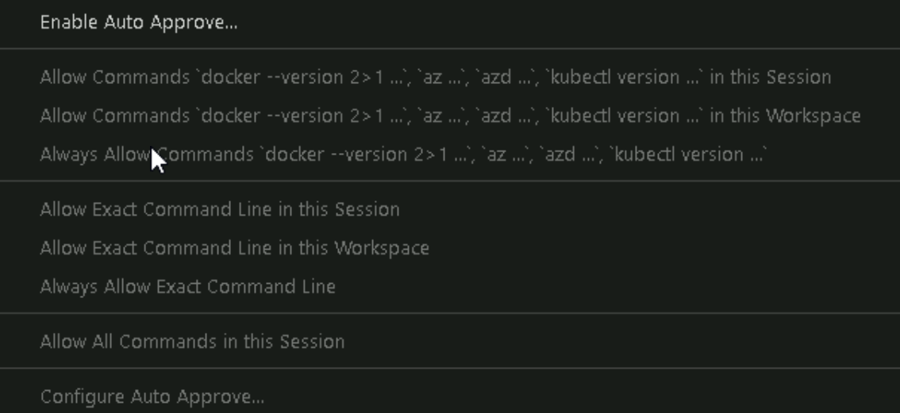
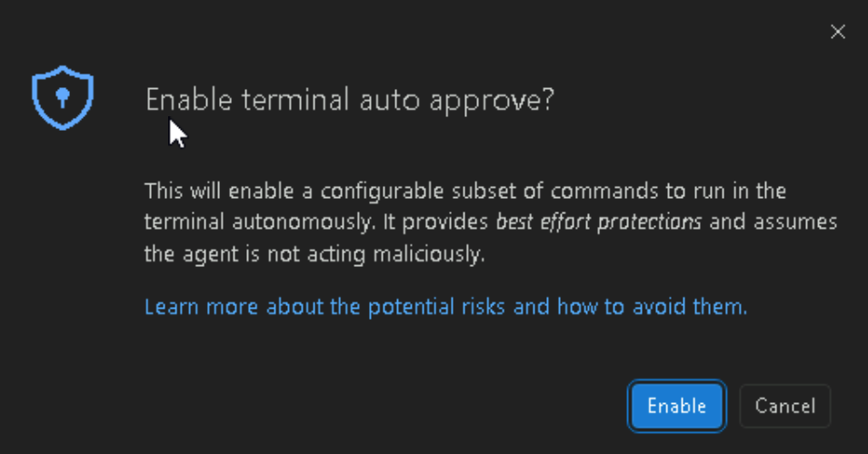
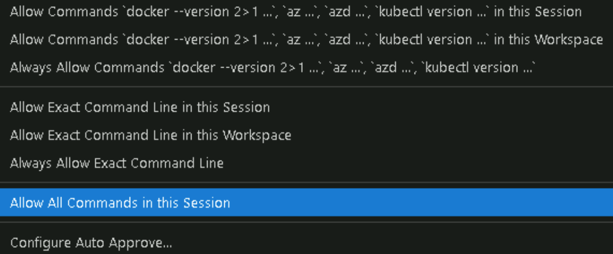

# Exercise 1: Lab Intro

**Duration:** 30 minutes

## Overview

This exercise reviews the solution architecture, introduces the lab, and validates that your environment is properly configured. You will walk through the Azure Agents Control Plane architecture to understand how each Azure service contributes to security, governance, and observability. You will then learn about the SpecKit specification-driven methodology that guides agent development throughout the lab. Finally, you will use GitHub Copilot in Agent Mode to verify prerequisites, confirm AKS connectivity, set environment variables, build and push a Docker image to ACR, and run the environment validation test to ensure everything is working end-to-end.

> [WARNING]
> **Elevated Permissions in This Lab Environment**
>
> For the purpose of this lab, your access to the Azure subscription and resource group is at the **Owner** level. This level of access gives the AI coding agent atypical permissions. When in autonomous mode, the AI may need to temporarily disable a security control (e.g. private access) in order to successfully deploy an update to a resource that is behind the private network. The VM that the lab runs on might not have the proper networking configuration.
>
> **This is not a representation of a best practice.** This workaround is not recommended and it demonstrates — in and of itself — the need to scope down RBAC to identities to prevent the ability to make these kinds of changes.
>
> In the interest of time, however, the lab designers needed to accept this compromise to help the lab designers and learners complete the setup and the exercises themselves in a timely fashion.
>


---

## Step 1.1: Review Lab Objectives

By completing this lab, you will learn how to:

### Build Your Agent
- Review the SpecKit constitution and understand the SDLC principles in play
- Write a detailed specification for your agent by following the SpecKit methodology
- Integrate with the Azure Agents Control Plane infrastructure as follows:
  - Implement an MCP-compliant agent using FastAPI
  - Containerize your agent with Docker
  - Deploy your agent to AKS as a new pod

### Enterprise Governance
- Understand how Azure API Management acts as the governance gateway
- Inspect APIM policies that enforce rate limits, quotas, and compliance with enterprise standards
- Trace requests through the control plane

### Security & Identity
- Learn how identities are used for agents running in AKS pods
- Implement least-privilege RBAC for agent resources and tooling access
- Validate keyless authentication patterns

### Observability
- Monitor agent behavior using Azure Monitor and Application Insights
- Browse or Query telemetry with Kusto Query Language (KQL)

### Evaluation & Fine-Tuning
- Capture agent episodes for training data collection
- Label episodes with rewards (human or automated)
- Fine-tune models using Agent Lightning
- Run structured evaluations measuring intent resolution, tool accuracy, and task adherence

---

## Step 1.2: Review Solution Architecture

### Azure Agents Control Plane

The Azure Agents Control Plane provides centralized security, governance, and observability for enterprise AI agents. The following diagram depicts the runtime architecture:


The diagram is read from left to right where callers like M365 Copilot or MCP‑compatible APIs invoke agents in the control plane.

### Architecture Components

The control plane is composed of Azure services that each fulfill a distinct role — from API governance and identity to memory and observability. Together, they form a layered architecture where every agent request is authenticated, authorized, planned, actioned, logged, and traceable.

| Component | Azure Service | Purpose |
|-----------|---------------|---------|
| API Gateway | Azure API Management | Governance, rate limiting, OAuth validation |
| Agent Runtime | Azure Kubernetes Service | Workload identity, container orchestration |
| Short-Term Memory | Azure Cosmos DB | Session context, episode storage |
| Long-Term Memory | Azure AI Search | Historical data, vector search |
| Facts/Ontology | Microsoft Fabric / Storage Account | Domain knowledge, grounded facts |
| AI Models | Azure AI Foundry | LLM inference, embeddings |
| Identity | Microsoft Entra ID | Agent identity, RBAC |
| Observability | Azure Monitor + App Insights | Metrics, traces, logs |

### GitHub Copilot Agent Mode in VS Code

Throughout this lab you will use **GitHub Copilot in Agent Mode** to generate code, run terminal commands, and iterate on your agent implementation — all from within VS Code. The following walkthrough shows the GitHub Copilot in Agent Mode Approvals interactions.

**Step 1 — Open Copilot Chat and Select Agent Mode**

Open the Copilot Chat panel (`Ctrl+Alt+I`) and select **Agent** from the mode dropdown at the top of the chat window. Agent Mode allows Copilot to execute multi-step tasks: it can read files, run terminal commands, edit code, and chain actions together autonomously.

**Step 2 — Enter a Prompt and Review the Plan**

Type your prompt in the chat input — for example, *"Check that I have the prerequisites installed."* Copilot will propose a plan of actions (terminal commands, file reads, etc.). You can also set Copilot to auto approve by through the following actions:





And then choose which level of approval e.g. Allow All Commands in this Session




**Step 3 — Copilot Executes and Reports Results**

Copilot runs the commands in VS Code's integrated terminal, captures the output, and reports the results directly in the chat panel. If any step fails, Copilot will suggest corrective actions you can either have auto-approved or manually approve and execute.


### SpecKit Methodology

SpecKit is a specification-driven development methodology that ensures all agents are properly defined before implementation. Rather than jumping straight into code, SpecKit requires you to first articulate what your agent does, what tools it exposes, its governance model, and its expected behavior — all in a structured specification document.

The project is organized around two key artifacts:

- **Constitution** — The governance framework that applies to all agents in the project. It defines shared principles such as security posture, naming conventions, MCP compliance requirements, and approval policies. Every agent specification must conform to the constitution.
- **Specifications** — Individual agent definitions that describe the agent's domain, tools, input/output schemas, risk levels, and test criteria. In Exercise 2, you will write your own specification before generating any implementation code.

- `.speckit/`
  - `constitution.md`           # Core principles and governance framework
  - `specifications/`           # Individual agent specifications
    - `customer_churn_agent.spec.md`
    - `devops_cicd_pipeline_agent.spec.md`
    - `your_agent.spec.md`    # Your agent specification (Exercise 2)

The SpecKit workflow follows this sequence:

1. **Review the constitution** to understand the rules your agent must follow
2. **Update/Write a specification** describing your agent's purpose, tools, and governance model
3. **Use GitHub Copilot** to generate implementation code from the specification
4. **Validate** that the implementation matches the specification through testing

You will work hands-on with SpecKit in Exercise 2: Build Agents.

---

## Step 1.3: Validate Environment

Use **GitHub Copilot in Agent Mode** to complete each validation step below. Open Copilot Chat (`Ctrl+Alt+I`), select **Agent** mode from the dropdown, and enter the prompts listed for each step. Copilot will run the commands in VS Code's integrated terminal and help you resolve any issues.

### Auto Approving Agent Actions


### Prerequisites Check

Copilot Prompt:

```
Check that I have the prerequisites installed: Python 3.11+, Docker, Azure CLI (az and azd), and kubectl. Also verify I'm logged in to Azure.
```

Copilot will run the version checks and report any missing tools.

### AKS Cluster Access

Copilot Prompt:

```
Verify I can connect to the AKS cluster and that the mcp-agents namespace exists.
```


Copilot will run `kubectl get nodes` and `kubectl get namespace mcp-agents`. If the connection fails, ask Copilot: *"Help me get AKS credentials for my cluster."*

### Environment Variables

Copilot Prompt:

```
Check that the required environment variables are set: CONTAINER_REGISTRY, AZURE_TENANT_ID, FOUNDRY_PROJECT_ENDPOINT, and COSMOSDB_ENDPOINT.
```

Copilot will inspect your terminal session and identify any missing variables. If values are missing, ask Copilot: 

```
Help me set the missing environment variables from my Azure deployment.
```

### Port-Forward Tunnel to MCP Agents

Copilot Prompt:

```
Open a port-forward tunnel to the mcp-agents service in AKS on port 8000.
```

Copilot will run `kubectl port-forward -n mcp-agents svc/mcp-agents 8000:80` in a background terminal. While the tunnel is active, agent endpoints are available at `http://localhost:8000`. Use a separate terminal for running tests.

### Grant Cosmos DB Data Access

The lab user (defined in the **Environment** tab of your lab portal) needs read/write access to all databases and containers in the Cosmos DB account. This assigns the built-in **Cosmos DB Built-in Data Contributor** role to your signed-in Azure user at the account scope.

Copilot Prompt:

```
Grant my signed-in Azure user the Cosmos DB Built-in Data Contributor role on the Cosmos DB account in the apim-mcp-aks resource group. Use the following command:

az cosmosdb sql role assignment create \
  --account-name cosmos-$(az resource list --resource-type Microsoft.DocumentDB/databaseAccounts --query "[0].name" -o tsv) \
  --resource-group apim-mcp-aks \
  --role-definition-id 00000000-0000-0000-0000-000000000002 \
  --principal-id $(az ad signed-in-user show --query id -o tsv) \
  --scope "/"
```

Copilot will resolve your Cosmos DB account name and your Azure AD principal ID, then create the role assignment. Once complete, your portal user will have read/write access to all databases and containers in the account.

### Build Docker Image and Push to ACR

Copilot Prompt:

```
Build the Docker image from src/Dockerfile and push it to the Azure Container Registry specified by the CONTAINER_REGISTRY environment variable.
```

Copilot will log in to ACR, build the Docker image, tag it with the registry name, and push it. If the `CONTAINER_REGISTRY` variable is not set, Copilot will help you retrieve it from your Azure deployment.


### Execute Environment Validation Test

Copilot Prompt:

```
Activate the .venv virtual environment and run tests/test_next_best_action_functional.py in direct mode. If AKS isnt started, start it.
```

Copilot will activate the virtual environment, navigate to the tests directory, and execute the connection test.

Expected output:

> All tests passed. Here's the summary:
>
> - AKS: Already running (2 pods in mcp-agents namespace)
> - Port-forward: Already active on port 8000
> - Test results: All 3 next_best_action tests + semantic similarity test PASSED

### Troubleshooting

| Issue | Solution |
|-------|----------|
| AKS connection failed | Run: `az aks get-credentials --resource-group <rg> --name <cluster>` |
| Namespace not found | Deploy base infrastructure: `azd provision` |
| Pods not running | Check logs: `kubectl logs -n mcp-agents -l app=mcp-server` |
| Pod not starting | Check logs: `kubectl logs -n mcp-agents -l app=my-agent` |
| Health endpoint failing | Verify service: `kubectl get svc -n mcp-agents` |
| Health check failing | Ensure `/health` endpoint returns 200 |
| Image pull errors | Verify ACR login: `az acr login --name <registry>` |
| Workload identity issues | Verify service account annotations |

---

## Completion Checklist

Before proceeding to Exercise 2, please confirm the following:

- [ ] Reviewed lab objectives and understand what you will build
- [ ] Reviewed solution architecture and key Azure services
- [ ] Environment validation script executed successfully
- [ ] All required tools installed (Python, Docker, Azure CLI, kubectl)
- [ ] Connected to AKS cluster
- [ ] Environment variables configured
- [ ] next_best_action tests PASSED!

---

To continue the lab, click on the **Next** button.
