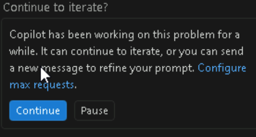
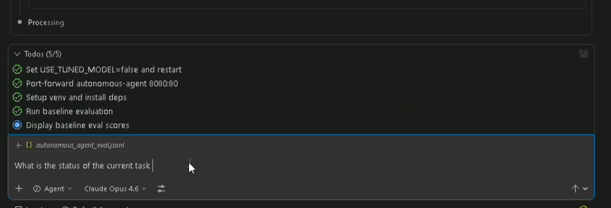

# Exercise 2: Build Agents using GitHub Copilot and SpecKit

**Duration:** 1 hour

## Overview

In this exercise, you will use GitHub Copilot and the SpecKit to specify, create, unit test, and deploy an **Autonomous Agent** that operates independently without human intervention.

> [TIP]
> **Managing Copilot Chat Sessions**
>
> Start a **new Copilot chat session** after completing each logical stopping point (e.g. after finishing a Part or a major Step). This keeps the context window focused and prevents earlier conversation history from confusing later prompts. To start a new session, click the **+** button at the top of the Copilot Chat panel.
>

> 

> [TIP]
> **Copilot May Pause and Ask to Continue**
>
> For longer tasks, Copilot may stop partway through and ask if you'd like it to continue. Keep an eye on the chat panel — when you see a prompt asking to proceed, click **Continue** to let Copilot finish its work.

>
> 

> [TIP]
> **Steering Copilot When It Gets Off Track**
>
> If Copilot takes a while, ask it for current status. If copilot starts heading in the wrong direction — generating code you didn't ask for, misinterpreting the specification, or making assumptions about your domain — you can steer it back on course. First, if Copilot is still processing, ask *"What's your current status?"* or *"What have you done so far?"* to understand where it is before redirecting. Then use short, direct follow-up prompts like *"Stop — that's not what I meant. Let me clarify…"* or *"Undo that last change and instead do X."* You can also highlight specific code in the editor and ask Copilot to focus only on that selection. Steering is a normal part of working with an AI pair programmer — treat it like redirecting a colleague, not a failure.
>
> 

> [TIP]
> **Troubleshooting: Prompts Requiring Excessive Back and Forth**
>
> If you find yourself repeatedly rephrasing prompts or Copilot isn't following complex instructions on the first attempt, check that you are using the **Claude Opus 4.6** model. Click the model selector at the bottom of the Copilot Chat panel and ensure **Claude Opus 4.6** is selected. Other models may struggle with multi-step, specification-driven prompts and require significantly more steering.

> [TIP]
> **Previewing Markdown Files**
>
> To preview `.md` files in the VS Code editor pane, use the hotkey **Ctrl+Shift+V**. This opens a rendered preview so you can read specifications, exercise documents, and other Markdown files without the raw syntax.

---

## Part A: Review the Project Constitution

Before creating agents, you should understand the SDLC framework defined in the constitution.

### Step A.1: Open the Constitution

In VS Code Explorer, navigate to and open `.speckit/constitution.md`.

### Step A.2: Identify Key Concepts

As you review, take note at a high-level concepts that stand out in the following sections:

- **Project Overview**
- **Core Principles**
- **Development Standards**
- **Technical Architecture**
- **Success Criteria**
- **Constraints & Assumptions**
- **Governance**
- **Solution Architecture Summary**
- **Lab Integration**
- **References**

### Step A.3: Review Example Specifications

In VS Code Explorer, navigate to and open the following files:

- `.speckit/specifications/autonomous_carwash_agent.spec.md`
- `.speckit/specifications/customer_churn_agent.spec.md`
- `.speckit/specifications/healthcare_digital_quality_agent.spec.md`
- `.speckit/specifications/helpdesk_triage_agent.spec.md`
- `.speckit/specifications/user_security_agent.spec.md`

The first document: - `.speckit/specifications/healthcare_digital_quality_agent.spec.md` is what was used to build the existing next best action agent. 
Review the specifications. What do you make of the specifications? What aspects of specification will you re-use for your use-case?
---

## Part B: Build Autonomous Agent

You have three (3) options to build your autonomous agent:
1) use existing specification as-is
2) make changes to existing specification then use it
3) ask copilot to generate a new specification for you

### Step B.1: Use/Modify or Create Existing Specifications

1) To re-use an existing specification, then follow these instructions.
Choose one of the following and proceed to step B.3:

- `.speckit/specifications/autonomous_carwash_agent.spec.md`
- `.speckit/specifications/customer_churn_agent.spec.md`
- `.speckit/specifications/helpdesk_triage_agent.spec.md`
- `.speckit/specifications/user_security_agent.spec.md`

Note: please dont re-use the healthcare_digital_quality_agent.spec.md because its already built.

2) If you want to alter an existing specification then follow these instructions.
Be sure to edit the following with the actual use case information:

- `<use_case_file_root>`
- `<x,y,z>`

Copilot Prompt:

```
Make a copy of the .speckit/specifications/<use_case_file_root>.spec.md. Make the following changes to it: <x,y,z>.
```

3) If you want to create an new specification then follow these instructions.
Be sure to edit the following with the actual use case information:

Brainstorm what you want your agent to be / do. 
For the purposes of this exercise, there is no user interface for the agent. 
The agent is a python script that can accept an english based description of a task. 
It can then determine the intent of the task, reason and plan out steps to be done and then execute on them. Keep in mind, this agent of yours needs to be given boundaries an identity and RBAC permissions to resources / tools for it to perform its job. 

### Step B.2: Implement Autonomous Agent, Unit Test(s) and Functional Test(s) with Copilot

For reference, if you are inclined, review the code in the following files: `src/next_best_action_agent.py`, `src/next_best_action_agent_unit.py`, `src/next_best_action_agent_functional.py`. There are the files that are built from the `healthcare_digital_quality_agent.spec.md` specification. Its more of a catalog of methods than an official reference implementation but the functionality can be re-used as a template for your own agent. Note: clean-up, refactoring of these files are needed. Some of implementation choices were done so to accommodate the lab environment itself. 

Whether you create a new specification from scratch, made changes to an existing specification or just used an existing specification, you should end up in a position with specification that can now be used to create your agent. 

To create the agent,
Copilot Prompt:

```
Implement an MCP-compliant FastAPI agent based on the <autonomous_agent.spec.md> specification. Utilize src/next_best_action_agent.py as a reference implementation. Build the implementation similar to the reference implementation but in its own new file src/autonomous_agent.py. Be sure to include health endpoint, SSE endpoint, and message endpoint with tools/list and tools/call handlers. In addition to the domain-specific tools, include all of the Agent Lightning tools from the reference implementation (lightning_list_episodes, lightning_get_episode, lightning_assign_reward, lightning_list_rewards, lightning_build_dataset, lightning_list_datasets, lightning_start_training, lightning_get_training_status, lightning_list_training_runs, lightning_promote_deployment, lightning_get_active_deployment, lightning_list_deployments, lightning_rollback_deployment, lightning_deactivate_deployment, lightning_get_stats). These Lightning tools enable fine-tuning and reinforcement learning capabilities — include the Lightning imports, tool function definitions, tool catalog entries in tools/list, and tool dispatch handlers in tools/call exactly as they appear in the reference implementation. Also create pytest unit tests in tests/test_autonomous_agent_unit.py covering the health endpoint, MCP initialize, tools/list, and tools/call methods. Create functional tests in tests/test_autonomous_agent_functional.py covering the health endpoint, MCP initialize, tools/list, and tools/call methods. Make a new DockerFile specific to this new agent. Make a new k8s/autonomous-agent-deployment.yaml config file too.
```


### Step B.3: Generate Domain Knowledge Facts with Copilot

Your agent needs domain-specific facts to ground its reasoning. Copilot will generate ontology fact files for your agents domain and upload them. For the purposes of this lab, a storage account is being used to simulate fabric IQ from onelake.

Copilot Prompt:
```
Review the existing ontology fact files in facts/ontology/ (customer_churn_ontology.json, helpdesk_triage_ontology.json, user_management_ontology.json) as examples. Generate a new ontology fact file for my agents domain based on its specification. Save it to facts/ontology/<my_domain>_ontology.json following the same JSON structure. Then upload all ontology files from facts/ontology/ to the Azure Storage accounts ontologies container by creating and running scripts/upload-ontologies-to-storage.ps1.
```

### Step B.4: Ingest Domain Knowledge into AI Search with Copilot

Your agent needs task instruction documents indexed in Azure AI Search for long-term memory retrieval. Copilot will create the task instruction files, ingest them with embeddings, and provision the agentic retrieval infrastructure.

Copilot Prompt:

```
Review the existing task instruction documents in task_instructions/ as examples. Create a new task instruction JSON file for my agents domain based on its specification, following the same structure (id, title, category, intent, description, content with step-by-step instructions, keywords, estimated_effort, steps array, related_tasks). Save it to task_instructions/<my_domain>.json. Then activate the .venv and run python scripts/ingest_task_instructions.py to create the AI Search index, generate embeddings with text-embedding-3-large, upload the documents, and provision a Knowledge Source and Knowledge Base for agentic retrieval. Verify the index has documents and the Knowledge Source task-instructions-source and Knowledge Base task-instructions-kb exist on the search service.
```

### Step B.5: Enable Agentic Retrieval in K8s Deployment with Copilot

Your agents K8s deployment needs the AI Search environment variables to enable agentic retrieval at runtime.

Copilot Prompt:

```
Update my agents K8s deployment YAML (k8s/autonomous-agent-deployment.yaml or the configured variant) to add the following environment variables to the container spec: AZURE_SEARCH_ENDPOINT (set to the search service endpoint), AZURE_SEARCH_INDEX_NAME (set to task-instructions), and AZURE_SEARCH_KNOWLEDGE_BASE_NAME (set to task-instructions-kb). The AZURE_SEARCH_KNOWLEDGE_BASE_NAME is critical — it enables the AzureAISearchContextProvider to run in agentic mode using KnowledgeBaseRetrievalClient for multi-hop reasoning instead of basic hybrid search. Apply the updated deployment to AKS and verify the pods pick up the new environment variables.
```

After Copilot completes the above steps, your agent will have the following agentic retrieval architecture:

| Component | Purpose |
|---|---|
| `src/memory/aisearch_memory.py` | `LongTermMemory` class wrapping `AzureAISearchContextProvider` |
| `AzureAISearchContextProvider` | Microsoft Agent Framework provider with `mode="agentic"` |
| Knowledge Base (`task-instructions-kb`) | Server-side LLM-driven query planning, sub-query decomposition, answer synthesis |
| Knowledge Source (`task-instructions-source`) | Points to the `task-instructions` search index |
| `AZURE_SEARCH_KNOWLEDGE_BASE_NAME` env var | Tells the agent to use `KnowledgeBaseRetrievalClient.retrieve()` instead of basic `SearchClient.search()` |

### Step B.6: Run Unit Tests with Copilot

Copilot Prompt:

```
Check if a .venv virtual environment exists in the project root. If it doesnt, create one. Activate it, install the dependencies from src/requirements.txt, and run the unit tests in tests/test_autonomous_agent_unit.py with verbose output.
```

### Step B.7: Deploy Autonomous Agent with Copilot

Copilot Prompt:

```
Build the new Docker image for this agent in the src/ directory for my autonomous agent, tag it and push it to the Azure Container Registry using the CONTAINER_REGISTRY environment variable, then deploy it to AKS using k8s/autonomous-agent-deployment.yaml and verify the pods are running in the mcp-agents namespace.
```

### Step B.8: Run Functional Tests with Copilot

Copilot Prompt:

```
Set up a kubectl port-forward from the autonomous-agent service in the mcp-agents namespace on port 8080:80. Then check if a .venv virtual environment exists in the project root — if it doesnt, create one. Activate it, install the dependencies from src/requirements.txt, and run the functional tests in tests/test_autonomous_agent_functional.py with verbose output.
```

---

## Completion Checklist

Before proceeding to Exercise 3, please confirm the following:

- [ ] Specification created/updated
- [ ] Agent created with MCP endpoints
- [ ] Task instructions ingested into AI Search index
- [ ] Knowledge Source and Knowledge Base provisioned (agentic retrieval)
- [ ] Ontology facts uploaded to Azure Storage/Fabric IQ
- [ ] Unit tests passing
- [ ] Docker image built and pushed to ACR
- [ ] Agent deployed to AKS
- [ ] Functional tests passing

---

## Summary

Congratulations!, You have built an autonomous agent using GitHub Copilot and SpecKit.

The agent implements MC protocol and is integrated with the Azure Agents Control Plane for security, governance, adn observability.

---

To continue the lab, click on the **Next** button.
