# Building and Managing AI Agents using Azure Agents Control Plane

Welcome to Building and Managing AI Agents using Azure Agents Control Plane hands on hands-on lab, you will learn how the Azure Agents Control Plane governs the complete lifecycle of enterprise AI agents, including analysis, design, development, testing, fine-tuning, and evaluation. You will explore how Azure enables enterprise-grade AI agent development through centralized governance, observability, identity management, and compliance controls, regardless of where the agents are executed. By the end of the lab, you will understand how to leverage the Agents Control Plane to manage, monitor, and scale AI agents effectively while ensuring security, reliability, and regulatory compliance in enterprise environments.

## Accessing Your Lab Environment

On the **Lab VM**, when the **Choose privacy settings for your device** screen appears, leave all settings at their **default values**, then click **Next (1)**, click **Next (2)** again, and finally click **Accept (3)** to continue.


Once you're ready to dive in, your virtual machine and **Guide** will be right at your fingertips within your web browser.


If you get the pop-up of the powershell running the script **click on minimize** the screen.


## Virtual Machine & Lab Guide

Your virtual machine is your workhorse throughout the workshop. The lab guide is your roadmap to success.

## Exploring Your Lab Resources
 
To get the lab environment details, you can select the **Environment** tab. Additionally, the credentials will also be emailed to your registered email address.


 
## Utilizing the Split Window Feature
 
For convenience, you can open the lab guide in a separate window by selecting the **Split Window** button from the Top right corner.
 

 
## Managing Your Virtual Machine
 
Feel free to **Start, Stop, or Restart (2)** your virtual machine as needed from the **Resources (1)** tab. Your experience is in your hands!


## Lab Guide Zoom In/Zoom Out

To adjust the zoom level for the environment page, click the **A↕ : 100%** icon located next to the timer in the lab environment.

  

### Accessing GitHub

1. In a new tab, navigate to the **GitHub login** page by copying and pasting the following URL into the address bar:

   ```
   https://github.com/login
   ```

1. On the **Sign in to GitHub** tab, enter the provided **GitHub username** **(1)** in the input field, and click on **Sign in with your identity provider** to continue **(2)**.

    - GitHub User: Enter provided **GitHub User name** (i.e., which look similar to **odl-user-did_clabs**).

      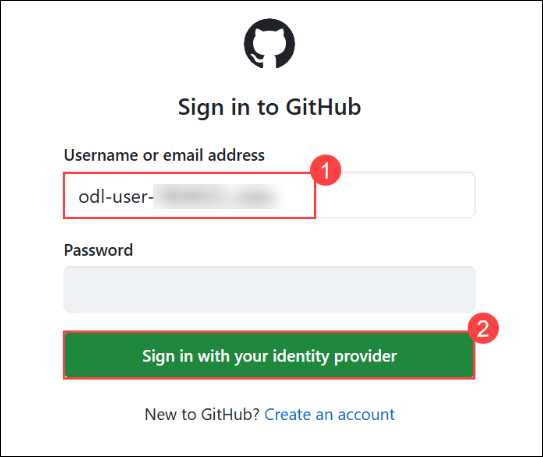

1. Click on **Continue** on the **Single sign-on to CloudLabs Organizations** page to proceed.

    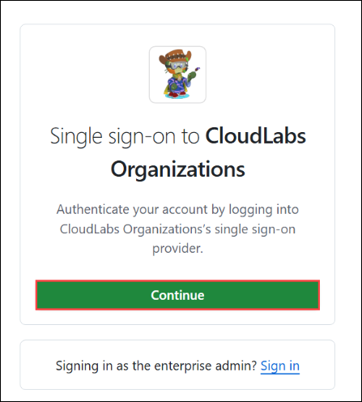

1. You'll see the **Sign in** tab. Here, enter your Azure Entra credentials:

   - **Email/Username:** Enter provided **GitHub Email ID**  (i.e., odl_user_did@msazurelabs.onmicrosoft.com)

       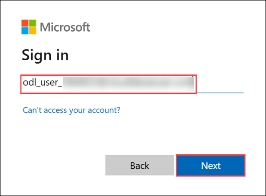

1. Provide your Temporary Access Pass and click on **Sign in**

   - **Password:** Enter provided **password**

      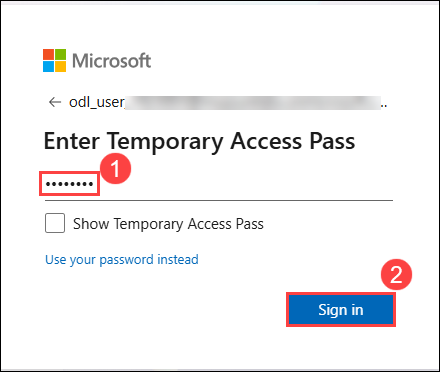

1. On the **Stay Signed in?** pop-up, click on No.

   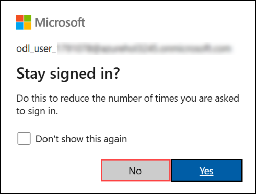

1. On the **Permission requested by** pop-up, click on **Accept**.

   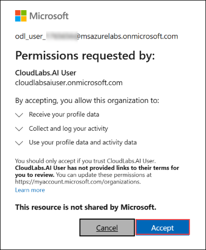

1. You are now successfully logged in to **GitHub**.

# Sign in to GitHub Copilot in Visual Studio Code

1. Open **Visual Studio Code** from the desktop screen. 

   
   
1. In the left pane, click on **Extensions**. 

   

1. At the search bar of the Extensions type **Github (1)**, select the **Github Copilot (2)** Extension and then click on **Install (3).**

   
   
1. Once the installation is successful, a pop-up appears to sign in. Click on **Sign in to Use Copilot for Free**

   

   >**Note:** If you don’t see any option here, you can click the icon at the bottom right and select **Sign in to use Copilot**.

   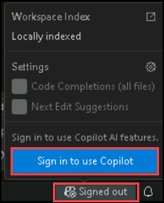

1. If you get the popup, click on **Allow**.

   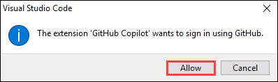

1. On the **Select user to authorize** page in the edge browser, click on **Continue**

   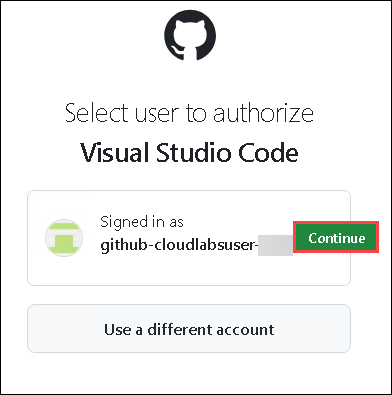

1. You will encounter a pop-up prompt. Click **Open** to proceed.

   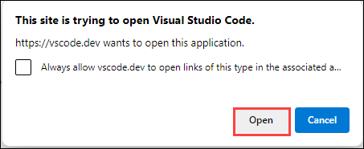

   >**Note:** If you get another pop-up stating **Allow an extension to open this URI**, please click on **Open**.

1. You will be able to see in the bottom right corner that GitHub Copilot has been activated.

   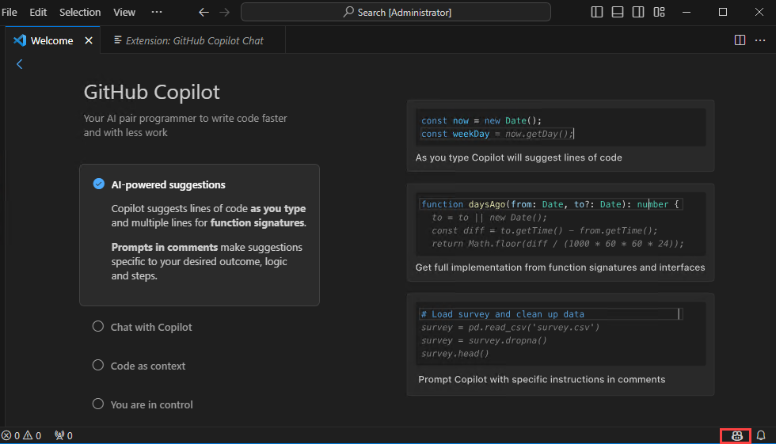

   >**Note:** If the activation status of Github Copilot in the bottom right corner is not visible, try restarting Visual Studio Code to ensure that the activation status becomes visible in that location.

1. Verify if **GitHub Copilot Chat** is installed. If it's installed, the chat window will open as shown below.
   
    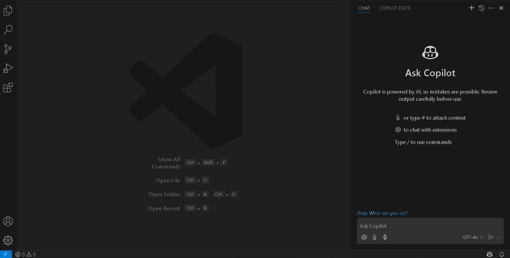

## Support Contact
 
The CloudLabs support team is available 24/7, 365 days a year, via email and live chat to ensure seamless assistance at any time. We offer dedicated support channels tailored specifically for both learners and instructors, ensuring that all your needs are promptly and efficiently addressed.

Learner Support Contacts:
- Email Support: cloudlabs-support@spektrasystems.com
- Live Chat Support: https://cloudlabs.ai/labs-support

### Happy Learning!!
