# Building and Managing AI Agents using Azure Agents Control Plane

Welcome to Building and Managing AI Agents using Azure Agents Control Plane hands-on lab, you will learn how the Azure Agents Control Plane governs the complete lifecycle of enterprise AI agents, including analysis, design, development, testing, fine-tuning, and evaluation. You will explore how Azure enables enterprise-grade AI agent development through centralized management, identity and access controls and observability through instrumentation, monitoring and alerting, regardless of where the agents are executed. By the end of the lab, you will understand how to leverage the Azure Agents Control Plane to manage, monitor, and scale AI agents effectively while ensuring security, reliability, and regulatory compliance in enterprise environments.

# Getting Started page

## Accessing Your Lab Environment

Once you're ready to dive in, your virtual machine and lab guide will be right at your fingertips within your web browser.

   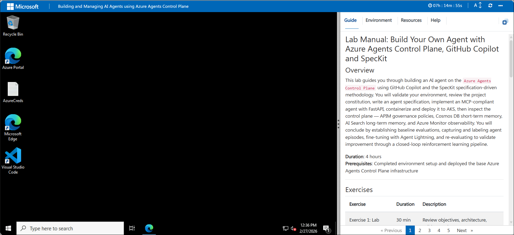

## Virtual Machine & Lab Guide
 
Your virtual machine is your workhorse throughout the workshop. The lab guide is your roadmap to success.
 
## Exploring Your Lab Resources
 
To get a better understanding of your lab resources and credentials, navigate to the **Environment** tab.
 
   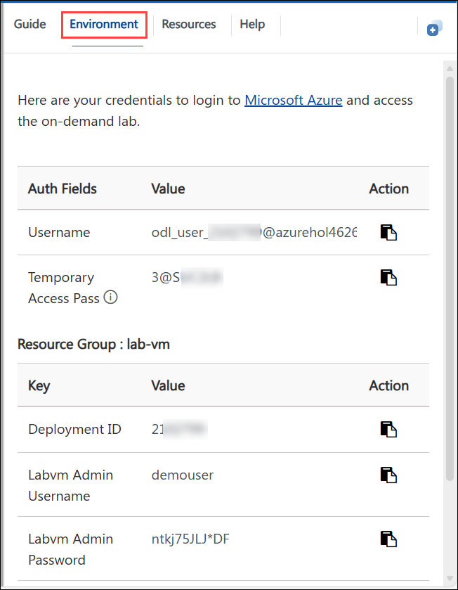
 
## Utilizing the Split Window Feature
 
For convenience, you can open the lab guide in a separate window by selecting the **Split Window** button from the Top right corner.
 
 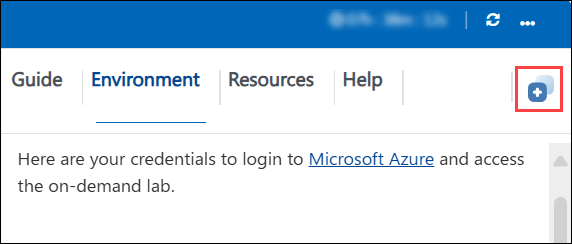
 
## Managing Your Virtual Machine
 
Feel free to **Start, Stop,** or **Restart (2)** your virtual machine as needed from the **Resources (1)** tab. Your experience is in your hands!
 
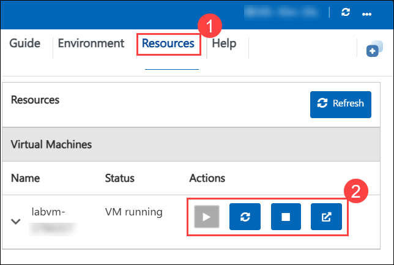

## Lab Guide Zoom In/Zoom Out

To adjust the zoom level for the environment page, click the **A↕: 100%** icon located next to the timer in the lab environment.

   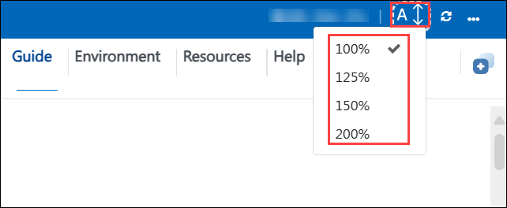

## Let's Get Started with Azure Portal

1. On your **Lab VM**, click on the **Azure Portal** icon as shown below:

   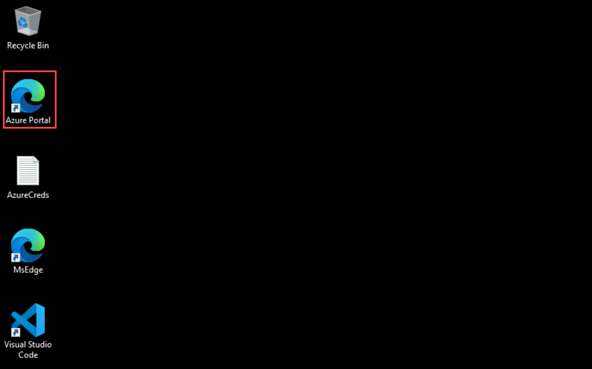
   
1. You'll see the **Sign into Microsoft Azure** tab. Here, enter your credentials:
 
   - **Email/Username:** <inject key="AzureAdUserEmail"></inject>
 
       
 
1. Next, provide your Temporary password:
 
   - **Temporary Acces Pass:** <inject key="AzureAdUserPassword"></inject>
 
       

1. If you see the pop-up **Stay Signed in?**, select **No**.       

1. If a **Welcome to Microsoft Azure** pop-up window appears, simply click **Cancel** to skip the tour.

## Accessing GitHub

1. Open the GitHub login page in a new tab within the same browser window using the provided URL below:

    ```
    https://github.com/login
    ```

1. On the Sign in to GitHub tab, you will see the login screen.

   - Enter your GitHub **Username (1)** as:

      ```
      odl-user-<inject key="DeploymentID"></inject>_clabs
      ```
   - Click on Sign in with your identity **provider (2)** to continue.

      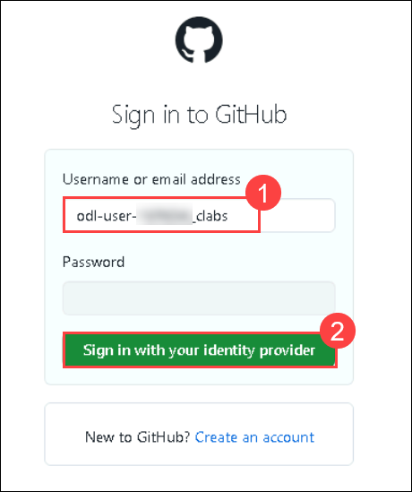

1. Click on **Continue** on the **Single sign-on to CloudLabs Organizations** page to proceed.

    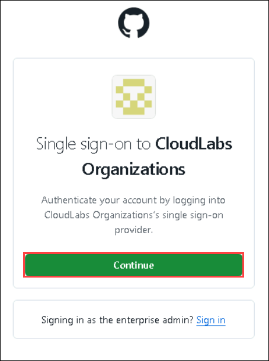

1. On the **Permission requested by** pop-up, click on **Accept.**

    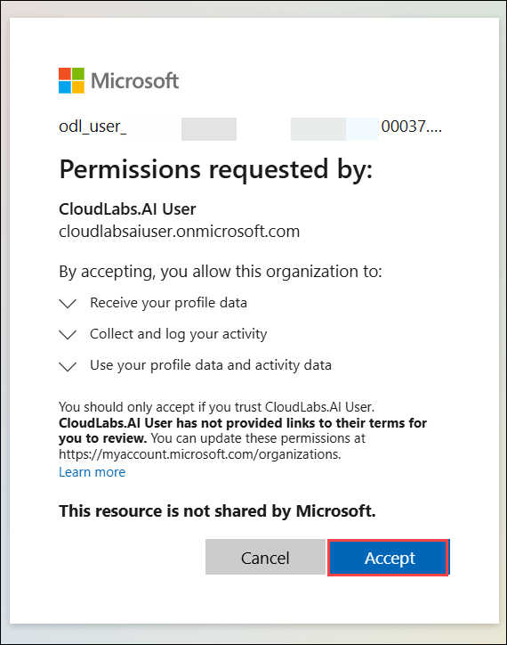

1. You are now successfully logged in to GitHub.

1. Open **Visual Studio Code** from the desktop screen.

   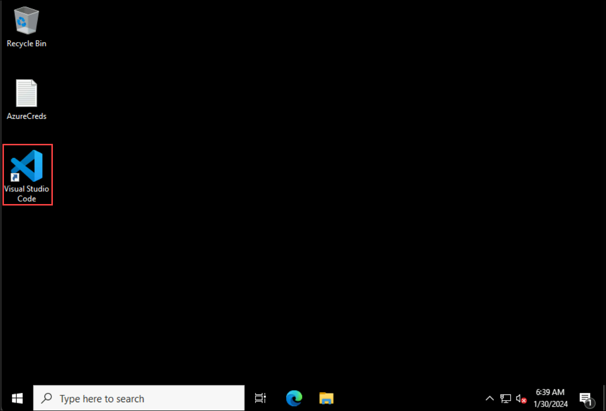

1. To sign in to Copilot, click on **Signed out** **(1)** and select **Enable more AI features** **(2)**.

   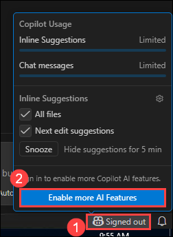

1. In the **Enable more AI features** pop-up, select **Continue with GitHub**.
   
   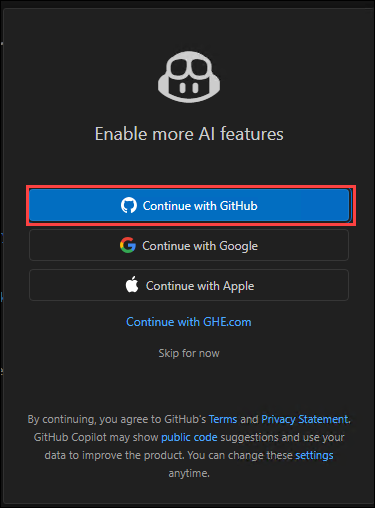

1. On the **Select user to authorize** page in the edge browser, click on **Continue**.

   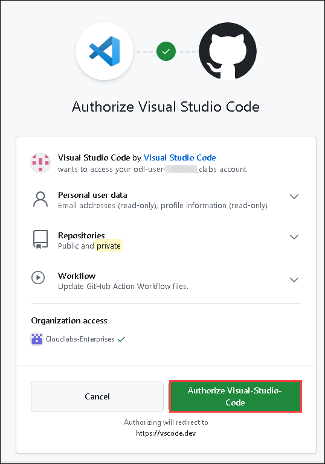

1. On the Authorize Visual Studio Code, click on **Authorize Visual-Studio-Code**.

   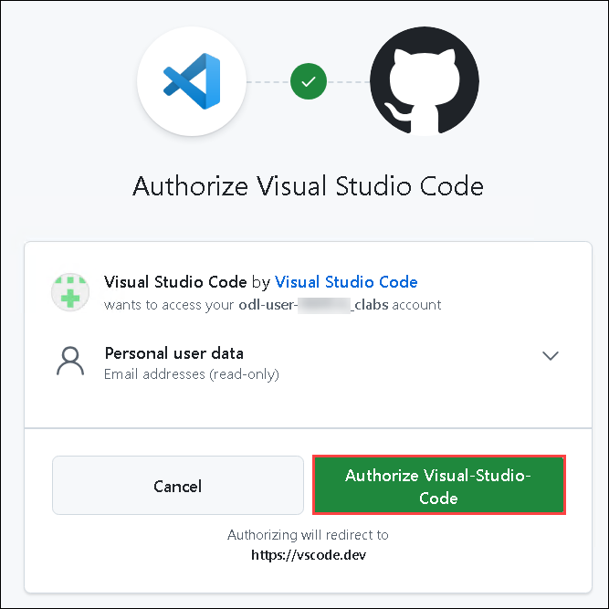

1. You will encounter a pop-up prompt. Click **Open** to proceed.

   

   > **Note:** If you get another pop-up stating **Allow an extension to open this URI**, please click on **Open**.

1. You will be able to see in the bottom right corner that GitHub Copilot has been activated.

   

   > **Note:** If the activation status of Github Copilot in the bottom right corner is not visible, try restarting Visual Studio Code to ensure that the activation status becomes visible in that location.

1. Verify if **GitHub Copilot Chat** is installed. If it's installed, the chat window will open as shown below.
   
    

## Support Contact

The CloudLabs support team is available 24/7, 365 days a year, via email and live chat to ensure seamless assistance at any time. We offer dedicated support channels tailored specifically for both learners and instructors, ensuring that all your needs are promptly and efficiently addressed.
 
Learner Support Contacts:
 
- Email Support: cloudlabs-support@spektrasystems.com
- Live Chat Support: https://cloudlabs.ai/labs-support

Now, click on **Next >>** from the lower right corner to move on to the next page.
 
### Happy learning!
